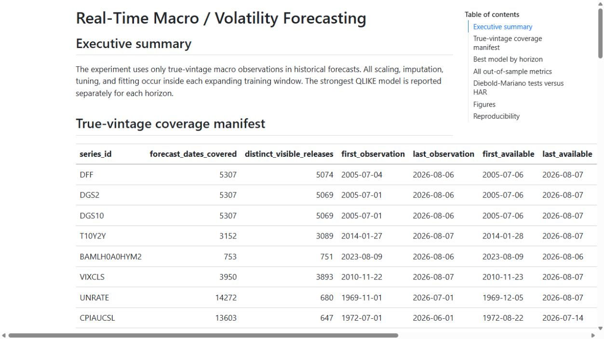
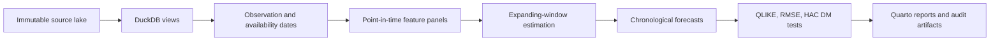
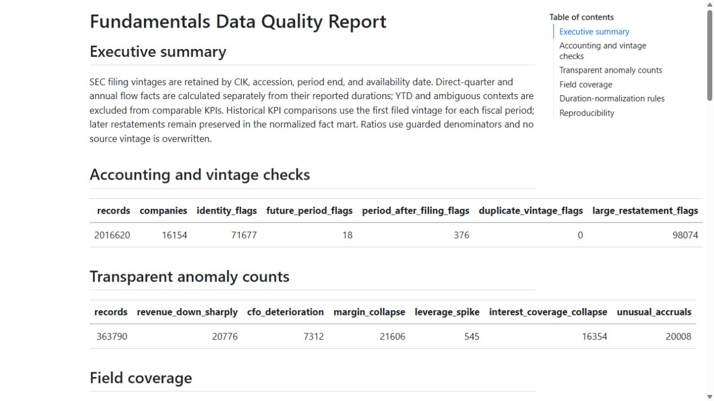

# Point-in-Time Volatility Research Platform

An R research portfolio centered on one question: **does information genuinely available at forecast time improve equity-index volatility forecasts beyond a parsimonious HAR baseline?**

The repository also contains two supporting case studies—a European bank capital/profitability monitor and a duration-aware SEC fundamentals pipeline—to demonstrate that the same information-timing and data-contract principles carry across financial domains.

## Result first

**[View the curated eight-plot case study](https://financial-risk-research.tonykark123.chatgpt.site)** — the recruiter-facing narrative, with the complete 30-plot analysis available in its appendix.

**[Open the generated 30-plot research gallery](reports/plot_gallery.html)** — ten macro-forecasting, ten bank-risk, and ten company-fundamentals views, with an auditable [plot manifest](reports/plot_gallery_manifest.csv).

The flagship experiment produced **127,218 chronological out-of-sample forecasts** across 28 model–horizon combinations. HAR-VIX achieved the lowest QLIKE at every evaluated horizon:

| Horizon | Best model | QLIKE | Variance RMSE |
|---:|:---|---:|---:|
| 1 day | HAR-VIX | -6.538962 | 0.000574 |
| 5 days | HAR-VIX | -6.671805 | 0.001619 |
| 10 days | HAR-VIX | -5.916593 | 0.003007 |
| 22 days | HAR-VIX | -4.946431 | 0.006556 |

Tree ensembles did not improve on the compact HAR-VIX specification. That negative complexity result is retained rather than hidden.



## Research design



Core safeguards:

- Macro history in the primary experiment is limited to a controlled true-vintage set; revised history is not admitted.
- Forward targets become trainable only after the complete forecast horizon has elapsed.
- Imputation, scaling, tuning and fitting occur inside each training window.
- Overlapping-horizon Diebold–Mariano comparisons use HAC inference.
- Model failures and negative benchmark results remain visible in the outputs.

## Supporting case studies

### European bank capital and profitability monitor

The bank panel covers **144 banks, 28 countries and 1,893 bank-quarter observations**. It scores only supported capital and profitability dimensions. Credit, bank-equity market and country-macro dimensions are explicitly unavailable.

All fitted CET1-deterioration models have negative out-of-sample R-squared relative to a zero-change persistence benchmark. Accordingly, this component is presented as a **monitoring and descriptive sensitivity system—not a forecasting success or comprehensive bank-risk model**.

### Duration-aware SEC fundamentals pipeline

The supplied lake exposes **124,727,683 upstream XBRL facts** and 3,212,976 filing records. The project directly transforms **11,050,014 selected facts with duration metadata** and produces **2,162,632 comparable KPI records** for 15,752 issuers.

- Direct-quarter and annual facts are processed separately.
- YTD and ambiguous durations are excluded from comparable KPIs.
- KPI history uses the first filed vintage for each fiscal period.
- Amendments and restatements remain preserved in the normalized fact mart.
- “Net debt / EBITDA” was removed because EBITDA is unavailable; the implemented proxy is accurately named `net_debt_to_operating_income_proxy`.
- Asset-size cohorts are labeled size cohorts, not industry peers.



## What the project does—and does not—claim

| Component | Defensible claim | Explicit boundary |
|:---|:---|:---|
| Macro | True-vintage, chronological model comparison | Daily close-to-close variance proxy, not intraday realized variance |
| Bank | Capital/profitability monitoring and descriptive sensitivities | Conservative pseudo-PIT; exact EBA publication timestamps are unavailable |
| SEC | Duration-separated, first-vintage comparable KPI history | Normalized selected concepts, not all 124.7M facts transformed into KPIs |
| Cohorts | Period-specific asset-size comparisons | Not sector, industry or country peer groups |

## Five-minute recruiter demo

The offline demo uses deterministic fixtures and does not require the 7.9 GB source lake:

```powershell
& 'C:\Program Files\R\R-4.6.1\bin\Rscript.exe' scripts/run_demo.R
```

The script runs a separate seven-target pipeline, writes `demo/output/portfolio_demo.html`, records runtime in `demo/output/runtime.json`, and fails if execution exceeds 300 seconds. The latest verified clean-store runtime on the development machine is **0.58 seconds**.

## Full reproduction

```powershell
& 'C:\Program Files\R\R-4.6.1\bin\Rscript.exe' -e "renv::restore()"
& 'C:\Program Files\R\R-4.6.1\bin\Rscript.exe' -e "targets::tar_make()"
& 'C:\Program Files\R\R-4.6.1\bin\Rscript.exe' -e "testthat::test_dir('tests/testthat')"
```

Set `FINANCIAL_RESEARCH_UPSTREAM_ROOT` to the source-lake directory, or edit `upstream_root` in `config.yml`. The full pipeline is designed for the local source lake; generated gold data, databases and rendered reports are excluded from version control. The deterministic demo fixtures are included for CI and review.

## Engineering evidence

- R, DuckDB, Parquet, `targets`, `renv`, `testthat` and Quarto.
- 27 registered local DuckDB tables/views.
- Unit tests for PIT joins, deliberate leakage failures, chronological splits, filing vintages, duration classification, financial identities and schema contracts.
- GitHub Actions runs the tests and offline demo without the private source lake.
- Structured pipeline, quality, model-run and failure logs.
- Machine-generated CV metrics, skeptical final audit and interview defense notes.

## Key outputs

- `reports/macro_vol/macro_volatility_forecasting.html` — flagship research report
- `reports/bank_risk/bank_risk_monitor.html` — bounded bank monitor
- `reports/fundamentals/company_kpi_dashboard.html` — duration-aware KPI dashboard
- `reports/cv_metrics.md` — machine-generated scale metrics
- `reports/final_audit.md` — limitations and trust decision
- `reports/interview_notes.md` — research-defense notes

See `reports/repository_audit.md` for source inventory and provenance details.

