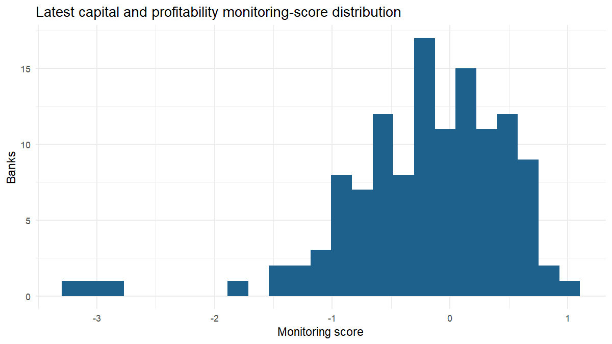

## Executive summary

The bank panel contains **144 banks** across **16 reporting periods**. Capital and profitability dimensions are scored where supported. This is a **capital and profitability monitor, not a comprehensive bank-risk model**. Credit, bank-equity market, and country-macro dimensions remain explicitly unavailable rather than imputed from unsuitable aggregates. Availability is conservative pseudo-PIT because exact EBA publication timestamps are absent.

## Latest transparent ranking

|Bank                                   |Country | CET1 (%)| Leverage (%)| RWA density (%)| Monitoring score|
|:--------------------------------------|:-------|--------:|------------:|---------------:|----------------:|
|Unmapped LEI DZZ47B9A52ZJ...           |DE      |    14.02|         7.11|           45.50|            1.017|
|de Volksbank N.V.                      |NL      |    19.71|         5.20|           24.11|            0.816|
|Unmapped LEI 213800TC9PZR...           |MT      |    16.61|         4.46|           25.82|            0.775|
|Deutsche Bank AG                       |DE      |    13.50|         4.60|           26.34|            0.704|
|Unmapped LEI AT0000000000...           |AT      |    14.66|         7.30|           51.28|            0.668|
|Norddeutsche Landesbank -Girozentrale- |DE      |    15.44|         5.54|           36.17|            0.616|
|Unmapped LEI 2138008AVF4W...           |RO      |    17.20|         4.58|           29.01|            0.603|
|SBAB Bank AB – group                   |SE      |    12.12|         4.39|           26.19|            0.598|
|Société Générale S.A.                  |FR      |    13.11|         4.17|           27.20|            0.594|
|Groupe BPCE                            |FR      |    15.59|         5.02|           31.88|            0.590|
|Unmapped LEI 529900GM944J...           |DE      |    15.56|         3.68|              NA|            0.589|
|HASPA Finanzholding                    |DE      |    17.59|         8.73|           48.25|            0.577|
|Unmapped LEI 485100FX5Y9Y...           |LT      |    22.94|         4.06|           17.09|            0.574|
|Unmapped LEI 529900S1KHKO...           |DE      |    17.69|         4.33|              NA|            0.571|
|HSBC Continental Europe                |FR      |    15.12|         4.26|           23.78|            0.569|

## Descriptive scenario ranking

|Bank                                  |Scenario      | Change (pp)| Stressed (%)| Rank|
|:-------------------------------------|:-------------|-----------:|------------:|----:|
|SBAB Bank AB – group                  |Macro GDP -2% |       -0.15|        11.98|    1|
|CaixaBank, S.A.                       |Macro GDP -2% |       -0.15|        12.07|    2|
|Bankinter, S.A.                       |Macro GDP -2% |       -0.15|        12.29|    3|
|Banco Santander, S.A.                 |Macro GDP -2% |       -0.15|        12.33|    4|
|Banco Bilbao Vizcaya Argentaria, S.A. |Macro GDP -2% |       -0.15|        12.61|    5|
|Unmapped LEI 9CZ7TVMR36CY...          |Macro GDP -2% |       -0.15|        12.84|    6|
|ABANCA Corporación Bancaria S.A.      |Macro GDP -2% |       -0.15|        12.86|    7|
|BNP Paribas S.A.                      |Macro GDP -2% |       -0.15|        12.89|    8|
|Société Générale S.A.                 |Macro GDP -2% |       -0.15|        12.97|    9|
|Unmapped LEI 549300OLBL49...          |Macro GDP -2% |       -0.15|        13.10|   10|
|Unmapped LEI 96950001WI71...          |Macro GDP -2% |       -0.15|        13.20|   11|
|Banco de Sabadell, S.A.               |Macro GDP -2% |       -0.15|        13.33|   12|
|Deutsche Bank AG                      |Macro GDP -2% |       -0.15|        13.35|   13|
|Intesa Sanpaolo S.p.A.                |Macro GDP -2% |       -0.15|        13.40|   14|
|ABN AMRO Bank N.V.                    |Macro GDP -2% |       -0.15|        13.66|   15|

## Dimension coverage

|Dimension          |Supported |Treatment                     |
|:------------------|:---------|:-----------------------------|
|Capital            |TRUE      |Scored                        |
|Profitability      |TRUE      |Scored where ROA is available |
|Credit             |FALSE     |Explicitly unavailable        |
|Bank equity market |FALSE     |Explicitly unavailable        |
|Country macro      |FALSE     |Explicitly unavailable        |

## Information-timing status

|field             |value                                                           |
|:-----------------|:---------------------------------------------------------------|
|Status            |Conservative pseudo-PIT                                         |
|Availability rule |Quarter end + 120 calendar days                                 |
|Interpretation    |Prevents early use but is not an exact EBA publication calendar |

## Figures

## Reproducibility

Generated by the `targets`-orchestrated R pipeline.
