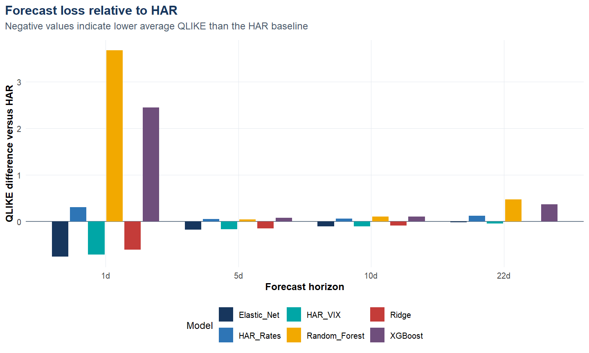
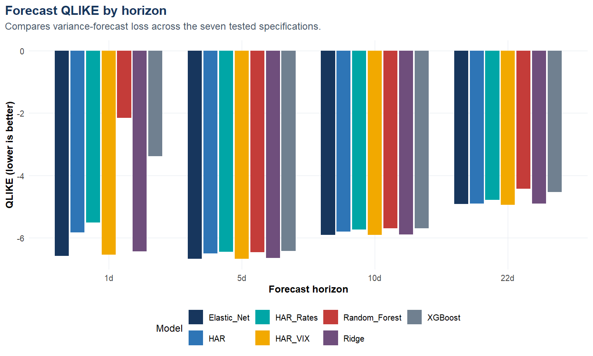
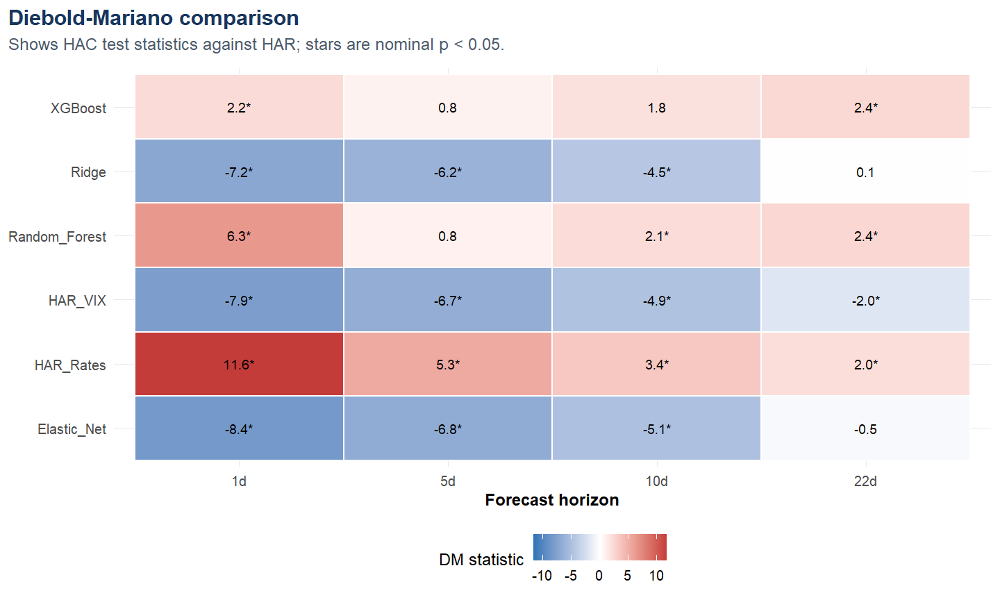
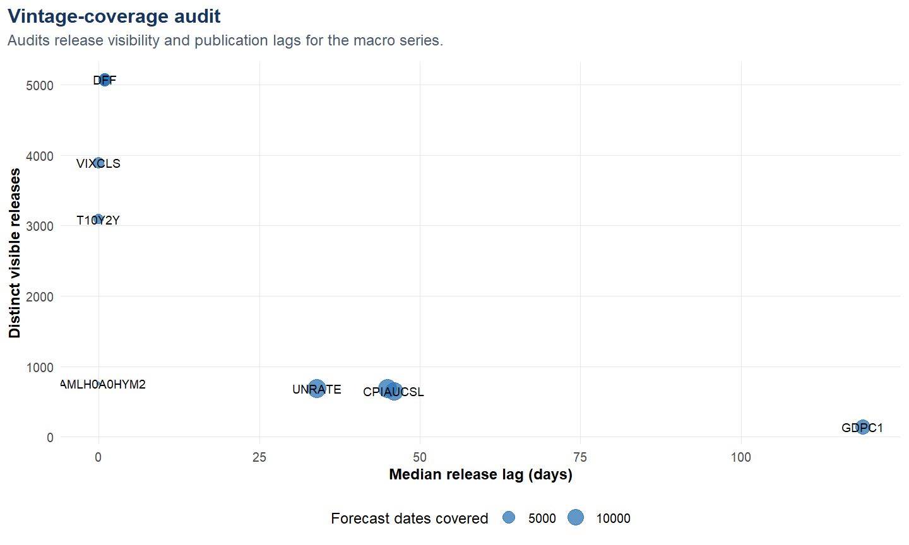

# Point-in-Time Volatility Forecasting

## Research question

**Does information genuinely available at forecast time improve equity-index volatility forecasts beyond a parsimonious HAR baseline?**

The corrected experiment has a split result: **Elastic Net had the lowest sample-average out-of-sample QLIKE at 1 and 5 days, while HAR plus VIX led at 10 and 22 days.** Neither tested tree ensemble led at any horizon under the implemented grids, validation objective, and retraining schedules. These are sample- and metric-specific rankings, not a general theorem that nonlinear models cannot help.



## Data and forecast target

The source panel starts from S&P 500 close-to-close daily returns and daily VIX observations in a read-only local data lake. The target is the sum of subsequent squared daily returns over 1, 5, 10, or 22 trading days. It is a **daily close-to-close variance proxy**, not an intraday realized-volatility measure.

Release-dated macro candidates include the federal funds rate, 2- and 10-year Treasury yields, the high-yield spread, unemployment, CPI, industrial production, and real GDP. A coverage audit also retains VIXCLS and T10Y2Y, but the model uses market VIX and reconstructs the curve slope from DGS10 minus DGS2. Forecast dates run from 2008-07-03 through 2026-08-07. The analysis imposes an after-close convention for same-day HAR and market-VIX inputs; the source records do not contain intraday availability timestamps, and each target uses only subsequent returns.

## Point-in-time design

- Each macro observation carries both an observation date and an availability date.
- As-of joins reject releases that were not yet visible on the forecast date.
- A forward target becomes eligible for training only after its full horizon has elapsed.
- Forecasting begins after a 756-row history; horizon-specific target gating leaves slightly fewer eligible training observations.
- Imputation and scaling use the outer training window; the held-out test observations never enter preprocessing or fitting.
- Linear and regularised models retrain every 22 trading days; tree models retrain every 66 days.
- Overlapping-horizon Diebold-Mariano comparisons use Newey-West/HAC covariance with horizon-dependent lags.
- Fitting errors are retained as missing row-level predictions; this execution recorded 0 failed forecast rows. Underperforming specifications remain in the committed metrics.

One methodological caveat matters: preprocessing is fitted on the full outer training window before the final 20% of that window is used for hyperparameter selection. There is no test-set leakage, but preprocessing is not strictly nested with respect to the tuning holdout.

## Models

1. **HAR:** log daily, weekly, and monthly volatility components.
2. **HAR + VIX:** HAR plus log market VIX.
3. **HAR + rates:** HAR plus the policy rate, 10-year yield, and curve slope.
4. **Ridge:** the full candidate set, fixed alpha 0, with 30 candidate penalties.
5. **Elastic Net:** the full set, fixed alpha 0.5, with 30 candidate penalties.
6. **Random Forest:** a small predefined search over `mtry`; 400 trees in the final fit.
7. **XGBoost:** four depth/learning-rate combinations with fixed sampling settings.

Hyperparameters are selected on a chronological validation tail using log-variance mean squared error. QLIKE is the primary final ranking metric, so the tree-model result should be read as a comparison of the implemented protocols rather than an exhaustive optimisation of QLIKE.

**Method revision (September 2026):** an audit found that `glmnet` reordered the supplied penalty path. Ridge and Elastic Net now select the validation winner from `base_fit$lambda`, and every published result artifact in this release was regenerated after that correction.

## Evaluation scale

The saved predictions contain **127,218 model forecasts** across **28 model-horizon combinations**. This count is 7 models multiplied by 18,174 date-horizon evaluations. The evaluations reuse the same forecast origins across models and horizons, and multi-day targets overlap, so they are not 127,218 independent market events. The largest horizon-specific panel contains 4,552 unique forecast dates.

## Main results


|Horizon |Lowest-QLIKE model | Forecast records|     QLIKE|      RMSE|
|:-------|:------------------|----------------:|---------:|---------:|
|1 days  |Elastic_Net        |             4552| -6.582416| 0.0005640|
|5 days  |Elastic_Net        |             4548| -6.681832| 0.0019086|
|10 days |HAR_VIX            |             4543| -5.916593| 0.0030070|
|22 days |HAR_VIX            |             4531| -4.946431| 0.0065556|

Lower QLIKE is better. The implementation averages `log(f) + y/f`, where `f` is forecast variance and `y` is the variance proxy. It omits an actual-only normalisation, which does not affect paired rankings; compare models within a horizon rather than raw QLIKE levels across horizons.


Elastic Net leads on average QLIKE at 1 and 5 days. At 10 days, HAR plus VIX and Elastic Net are nearly tied; no direct pairwise significance claim is made between them.


HAR plus VIX also has a lower average QLIKE than HAR at every horizon. Negative HAC Diebold-Mariano statistics favour HAR plus VIX. The comparisons are nominally significant at 5%, but the 22-day result is borderline and the table does not adjust for the 24 reported model-horizon comparisons against HAR.


|Horizon | HAC DM statistic|Nominal p-value |
|:-------|----------------:|:---------------|
|1 days  |           -7.945|< 1e-07         |
|5 days  |           -6.668|< 1e-07         |
|10 days |           -4.949|7.714e-07       |
|22 days |           -1.963|0.04971         |



## What the negative complexity result means

On full-sample average QLIKE, the implemented Random Forest and XGBoost specifications ranked below HAR plus VIX at every horizon. The result is not uniform across every economic-regime cell, and it does **not** establish that all nonlinear models, wider searches, alternative retraining schedules, or QLIKE-targeted tuning would fail.

## Vintage coverage


|Series       | Visible release dates| Median release lag (days)|Pipeline admits revised history |
|:------------|---------------------:|-------------------------:|:-------------------------------|
|DFF          |                  5074|                         1|FALSE                           |
|DGS2         |                  5069|                         1|FALSE                           |
|DGS10        |                  5069|                         1|FALSE                           |
|T10Y2Y       |                  3089|                         0|FALSE                           |
|BAMLH0A0HYM2 |                   751|                         0|FALSE                           |
|VIXCLS       |                  3893|                         0|FALSE                           |
|UNRATE       |                   680|                        34|FALSE                           |
|CPIAUCSL     |                   647|                        46|FALSE                           |
|INDPRO       |                   679|                        45|FALSE                           |
|GDPC1        |                   139|                       119|FALSE                           |

The final column records the pipeline policy applied to the availability-dated input, not an independent reconstruction of every provider's revision history.



## Limitations

- The target is based on daily close-to-close returns, not intraday realized volatility.
- The evidence covers one equity index and forecast dates from 2008-07-03 through 2026-08-07; other indices and periods are untested.
- Market history is retrieval-time data; availability-date controls apply to the macro-release panel.
- The tuning grids are deliberately small, selection uses log-MSE rather than QLIKE, and tree models retrain less often.
- Models are fitted to log variance and exponentiated for level metrics without a separate smearing correction.
- Nominal DM p-values are not adjusted for multiple comparisons.
- The analysis evaluates forecast loss, not positions, turnover, transaction costs, or trading profitability.
- A full numerical rebuild requires the private source lake. The public demo verifies mechanics, not the full headline result.

## Reproduction

```r
renv::restore()
targets::tar_make()
testthat::test_dir("tests/testthat")
```

Before the full pipeline, set `FINANCIAL_RESEARCH_UPSTREAM_ROOT` to the supplied source-lake directory. For a portable check that needs no private data, run:

```text
Rscript scripts/run_demo.R
```

The committed result snapshots are in [`results/`](../results/).
