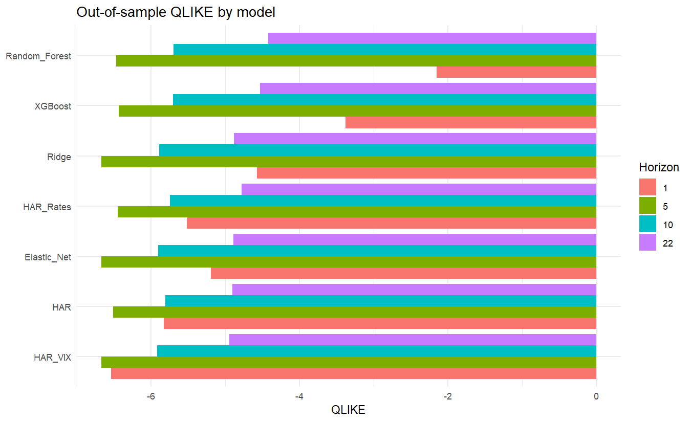

## Executive summary

The experiment uses only true-vintage macro observations in historical forecasts. All scaling, imputation, tuning, and fitting occur inside each expanding training window. The strongest QLIKE model is reported separately for each horizon.

## True-vintage coverage manifest

|series_id    | forecast_dates_covered| distinct_visible_releases|first_observation |last_observation |first_available |last_available | median_release_lag_days|true_vintage_primary |revised_history_admitted |
|:------------|----------------------:|-------------------------:|:-----------------|:----------------|:---------------|:--------------|-----------------------:|:--------------------|:------------------------|
|DFF          |                   5307|                      5074|2005-07-04        |2026-08-06       |2005-07-06      |2026-08-07     |                       1|TRUE                 |FALSE                    |
|DGS2         |                   5307|                      5069|2005-07-01        |2026-08-06       |2005-07-06      |2026-08-07     |                       1|TRUE                 |FALSE                    |
|DGS10        |                   5307|                      5069|2005-07-01        |2026-08-06       |2005-07-06      |2026-08-07     |                       1|TRUE                 |FALSE                    |
|T10Y2Y       |                   3152|                      3089|2014-01-27        |2026-08-07       |2014-01-28      |2026-08-07     |                       0|TRUE                 |FALSE                    |
|BAMLH0A0HYM2 |                    753|                       751|2023-08-09        |2026-08-06       |2023-08-09      |2026-08-06     |                       0|TRUE                 |FALSE                    |
|VIXCLS       |                   3950|                      3893|2010-11-22        |2026-08-07       |2010-11-23      |2026-08-07     |                       0|TRUE                 |FALSE                    |
|UNRATE       |                  14272|                       680|1969-11-01        |2026-07-01       |1969-12-05      |2026-08-07     |                      34|TRUE                 |FALSE                    |
|CPIAUCSL     |                  13603|                       647|1972-07-01        |2026-06-01       |1972-08-22      |2026-07-14     |                      46|TRUE                 |FALSE                    |
|INDPRO       |                  14272|                       679|1969-11-01        |2026-06-01       |1969-12-15      |2026-07-17     |                      45|TRUE                 |FALSE                    |
|GDPC1        |                   8693|                       139|1991-10-01        |2026-04-01       |1992-01-29      |2026-07-30     |                     119|TRUE                 |FALSE                    |

## Best model by horizon

| horizon|model   | forecasts|     QLIKE|   log_MSE|      RMSE|       MAE| rank_QLIKE|
|-------:|:-------|---------:|---------:|---------:|---------:|---------:|----------:|
|       1|HAR_VIX |      4552| -6.538962| 5.8838248| 0.0005742| 0.0001396|          1|
|       5|HAR_VIX |      4548| -6.671805| 0.7790574| 0.0016187| 0.0004603|          1|
|      10|HAR_VIX |      4543| -5.916593| 0.5679276| 0.0030070| 0.0008719|          1|
|      22|HAR_VIX |      4531| -4.946431| 0.5274878| 0.0065556| 0.0020059|          1|

## All out-of-sample metrics

|model         | horizon| forecasts|     QLIKE|   log_MSE|      RMSE|       MAE| rank_QLIKE|
|:-------------|-------:|---------:|---------:|---------:|---------:|---------:|----------:|
|HAR           |       1|      4552| -5.826424| 6.1463587| 0.0005980| 0.0001432|          2|
|HAR_VIX       |       1|      4552| -6.538962| 5.8838248| 0.0005742| 0.0001396|          1|
|HAR_Rates     |       1|      4552| -5.519622| 6.1756100| 0.0006021| 0.0001438|          3|
|Ridge         |       1|      4552| -4.570996| 6.0506092| 0.0005489| 0.0001435|          5|
|Elastic_Net   |       1|      4552| -5.194014| 6.0304946| 0.0005487| 0.0001434|          4|
|Random_Forest |       1|      4552| -2.150285| 6.4895771| 0.0006030| 0.0001453|          7|
|XGBoost       |       1|      4552| -3.377717| 6.2107351| 0.0006046| 0.0001456|          6|
|HAR           |       5|      4548| -6.509497| 0.9555781| 0.0016931| 0.0004795|          4|
|HAR_VIX       |       5|      4548| -6.671805| 0.7790574| 0.0016187| 0.0004603|          1|
|HAR_Rates     |       5|      4548| -6.451295| 0.9698921| 0.0017350| 0.0004799|          6|
|Ridge         |       5|      4548| -6.666823| 0.8069974| 0.0023583| 0.0005925|          3|
|Elastic_Net   |       5|      4548| -6.669426| 0.8166897| 0.0022796| 0.0005847|          2|
|Random_Forest |       5|      4548| -6.466926| 1.0386579| 0.0017990| 0.0005396|          5|
|XGBoost       |       5|      4548| -6.430979| 0.9346284| 0.0017737| 0.0005271|          7|
|HAR           |      10|      4543| -5.808945| 0.7136048| 0.0030463| 0.0009109|          4|
|HAR_VIX       |      10|      4543| -5.916593| 0.5679276| 0.0030070| 0.0008719|          1|
|HAR_Rates     |      10|      4543| -5.743063| 0.7358217| 0.0031360| 0.0009174|          5|
|Ridge         |      10|      4543| -5.891769| 0.6123139| 0.0039256| 0.0010845|          3|
|Elastic_Net   |      10|      4543| -5.900665| 0.6528683| 0.0038673| 0.0010919|          2|
|Random_Forest |      10|      4543| -5.699830| 0.8497076| 0.0032796| 0.0010794|          7|
|XGBoost       |      10|      4543| -5.702243| 0.7924958| 0.0034504| 0.0010897|          6|
|HAR           |      22|      4531| -4.902094| 0.6255647| 0.0063580| 0.0020490|          2|
|HAR_VIX       |      22|      4531| -4.946431| 0.5274878| 0.0065556| 0.0020059|          1|
|HAR_Rates     |      22|      4531| -4.779889| 0.6778860| 0.0066314| 0.0021489|          5|
|Ridge         |      22|      4531| -4.879697| 0.6458727| 0.0088375| 0.0027130|          4|
|Elastic_Net   |      22|      4531| -4.890264| 0.6428468| 0.0082555| 0.0025076|          3|
|Random_Forest |      22|      4531| -4.423042| 0.9970874| 0.0074211| 0.0027053|          7|
|XGBoost       |      22|      4531| -4.531853| 0.9114282| 0.0077080| 0.0027716|          6|

## Diebold-Mariano tests versus HAR

|model         | horizon|  statistic|   p_value|
|:-------------|-------:|----------:|---------:|
|HAR_VIX       |       1| -7.9445805| 0.0000000|
|HAR_Rates     |       1| 11.6366469| 0.0000000|
|Ridge         |       1|  1.3506273| 0.1768820|
|Elastic_Net   |       1|  1.1476042| 0.2511923|
|Random_Forest |       1|  6.3271851| 0.0000000|
|XGBoost       |       1|  2.1811055| 0.0292266|
|HAR_VIX       |       5| -6.6678231| 0.0000000|
|HAR_Rates     |       5|  5.2547747| 0.0000002|
|Ridge         |       5| -6.0097155| 0.0000000|
|Elastic_Net   |       5| -5.8998146| 0.0000000|
|Random_Forest |       5|  0.8202767| 0.4121014|
|XGBoost       |       5|  0.7609167| 0.4467463|
|HAR_VIX       |      10| -4.9493924| 0.0000008|
|HAR_Rates     |      10|  3.3842178| 0.0007199|
|Ridge         |      10| -4.4457563| 0.0000090|
|Elastic_Net   |      10| -4.1285885| 0.0000372|
|Random_Forest |      10|  2.1014889| 0.0356530|
|XGBoost       |      10|  1.8149079| 0.0696040|
|HAR_VIX       |      22| -1.9629703| 0.0497107|
|HAR_Rates     |      22|  2.0156603| 0.0438944|
|Ridge         |      22|  0.6107393| 0.5414028|
|Elastic_Net   |      22|  0.3182184| 0.7503339|
|Random_Forest |      22|  2.4159793| 0.0157323|
|XGBoost       |      22|  2.3725206| 0.0177087|

## Figures

## Reproducibility

Generated by the `targets`-orchestrated R pipeline.
